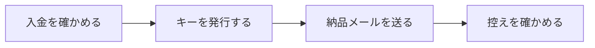

# 運用の手引き（販売者向け）

売り始めた後、日々やることをまとめています。<br>
**売り始めるまで**の手順は [SELLING-GUIDE.md](SELLING-GUIDE.md) にあります。

---

## 目次

| 項目 |
| --- |
| [1. 注文が入ってから納品まで](#order) |
| [2. 問い合わせへの対応](#support) |
| [3. 発行の控えを使う](#ledger) |
| [4. 鍵の保管と事故のとき](#keys) |
| [5. 版を上げるとき](#release) |
| [6. 人の目で見る分](#manual) |

---

## <a id="order"></a>1. 注文が入ってから納品まで



| # | やること | コマンド・置き場 |
| --- | --- | --- |
| 1 | 決済サービスで入金を確かめる | 決済サービスの管理画面 |
| 2 | キーを発行する | `python3 tools/keygen.py issue --name "…" --note "注文番号"` |
| 3 | 納品メールを送る | 文面は `docs/MAIL-TEMPLATES.md` の 1 |
| 4 | 控えに残っているか見る | `python3 tools/keygen.py list` |

発行の例です。

```bash
# 本体のみ・個人
python3 tools/keygen.py issue --name "山田太郎" --note "注文 1001"

# 本体＋確定申告オプション・法人5台
python3 tools/keygen.py issue --name "株式会社サンプル" --plan business --seats 5 \
  --ext tax --note "注文 1002"
```

> 🚨 **`--note` に注文番号を必ず入れてください。**<br>
> 後から「この人に何を売ったか」を引けるのは、控えのメモだけです。
> 入れ忘れると、再発行のときに購入者と発行を結びつけられません。

<br>

---

## <a id="support"></a>2. 問い合わせへの対応

| 症状 | 原因 | 対応 |
| --- | --- | --- |
| キーが登録できない | 貼り付けで欠けた／改行が混ざった | もう一度キー全体を送る。文面は `MAIL-TEMPLATES.md` の 2 |
| PC を買い替えた | 手元のデータが移っていない | 同じキーがそのまま使える。**再発行は要らない** |
| キーを無くした | メールを消した | 控えから[作り直す](#reissue) |
| データが消えた | ブラウザのデータを消した | **戻せません**。書き出した JSON があれば読み込む |
| 台数を増やしたい | 契約の変更 | 差額を受け取り、新しい台数で発行し直す |
| 返金してほしい | — | 使用許諾契約書のとおり、購入後14日以内の不具合に限る |

### データが消えたという問い合わせ

いちばん重い問い合わせです。**こちらでは復元できません**。
アプリは通信しないので、データは購入者のブラウザの中にしかありません。

> 💡 納品メールに「定期的に書き出してください」と書いてあります。
> 問い合わせが増えるようなら、メール文面の**その一文を目立たせて**ください。

### <a id="reissue"></a>キーを無くしたという問い合わせ

```bash
python3 tools/keygen.py list --find "山田"       # 番号を調べる
python3 tools/keygen.py reissue --row 12         # 同じ内容で作り直す
```

プラン・台数・期限・拡張の権利は、そのまま引き継がれます。

> ⚠️ **前のキーは使えなくなりません。**<br>
> アプリは通信しないため、**発行済みのキーを後から止める手段がありません**。
> 「無くした」と言われて作り直しても、古いキーが出回れば使えてしまいます。
> 不正が疑われるときは、次の版で公開鍵を変えるしかありません
> （＝**それまでのキーが全部無効になる**ため、実質使えません）。
>
> この割り切りは「サーバーを持たない・通信しない」ことと引き換えです。
> 詳しくは `taskdeck-docs` リポジトリの `docs/設計/セキュリティ設計.md` にあります。

<br>

---

## <a id="ledger"></a>3. 発行の控えを使う

控えは `keys/issued.csv` です。**発行したものはすべてここに残ります。**

```bash
python3 tools/keygen.py list                  # 全部
python3 tools/keygen.py list --find "サンプル"  # 購入者・メモ・発行日で探す
python3 tools/keygen.py list --ext tax        # 確定申告オプションを買った人だけ
python3 tools/keygen.py list --keys           # キーの本文も出す
```

| 使いどころ | コマンド |
| --- | --- |
| 更新版を案内する相手を調べる | `list` |
| オプションの購入者だけに連絡する | `list --ext tax` |
| 期限切れが近い契約を探す | `list`（期限切れには目印が付きます） |

> ⚠️ **`--keys` は画面共有中に使わないでください。**<br>
> キーの本文が出ます。既定では出さないようにしてあります。

> 🚨 **`keys/` を Git に入れないでください。**<br>
> 秘密鍵と全購入者のキーが入っています。`python3 tools/preflight.py` が
> Git に入っていないかを毎回見ます。

<br>

---

## <a id="keys"></a>4. 鍵の保管と事故のとき

| 対象 | 置き場 | 扱い |
| --- | --- | --- |
| 秘密鍵 `keys/private.json` | 手元 ＋ **リポジトリの外にバックアップ** | 公開厳禁 |
| 公開鍵 | `app/taskdeck.html` に埋め込み | 公開してよい |
| 控え `keys/issued.csv` | 手元 ＋ バックアップ | 公開厳禁 |

バックアップは**パスワード管理ソフト**か**暗号化した外部メディア**へ。
クラウドストレージに平文で置かないでください。

### 秘密鍵を失ったとき

| できること | できないこと |
| --- | --- |
| すでに売ったキーはそのまま使える | **新しいキーを発行できない** |
| — | 同じ公開鍵の鍵ペアを作り直す |

新しい鍵を作ると、**それまでに売ったキーが全部無効**になります。
購入者全員に作り直したキーを配り直すことになるため、実質やり直しがききません。

### 秘密鍵が漏れたとき

誰でもキーを発行できる状態です。次のどちらかになります。

| 選択 | 起きること |
| --- | --- |
| 何もしない | 偽造キーが出回る |
| 鍵を作り直して新版を出す | 購入者全員に配り直しが必要 |

**漏らさないことが唯一の対策**です。だからこそ `preflight` で毎回見ています。

<br>

---

## <a id="release"></a>5. 版を上げるとき

```bash
python3 tools/preflight.py          # 出す前に確認する
VERSION=1.1.0 bash tools/build.sh   # 新しい ZIP を作る
python3 tools/keygen.py list        # 案内する相手を調べる
```

| やること | 注意 |
| --- | --- |
| ZIP を作る | 公開鍵が未設定・テストが通らないときは止まります |
| ダウンロード先を差し替える | 古い URL も当面は残す |
| 購入者に案内する | 文面は `MAIL-TEMPLATES.md` の 4 |

> 🚨 **公開鍵は変えないでください。**<br>
> 変えると、それまでに発行したキーが**全部無効**になります。

<br>

---

## <a id="manual"></a>6. 人の目で見る分

`preflight` が見られないものです。**売り始める前に一度だけ**、自分で確かめてください。

| # | 確かめること | なぜ機械で見られないか |
| --- | --- | --- |
| 1 | 決済リンクを実際に押して購入画面まで進める | 決済サービスの中は見えない |
| 2 | 発行したキーが `TaskDeck.html` で実際に登録できる | 買った人と同じ手順を踏む必要がある |
| 3 | ダウンロード URL から ZIP が落ちてきて、開ける | 置き場は外部 |
| 4 | 納品メールにダウンロード URL・キー・窓口が入っている | 文面は都度変わる |
| 5 | 特商法表記の内容が実態と合っている | 内容の正しさは判断できない |
| 6 | 拡張つきのキーで、実際に制限が外れる | 買った人と同じ手順を踏む必要がある |

<br>

---

## 👀 関連

- [SELLING-GUIDE.md](SELLING-GUIDE.md) … 売り始めるまでの手順
- [MAIL-TEMPLATES.md](MAIL-TEMPLATES.md) … メールの文面
- [MANUAL.md](MANUAL.md) … 購入者向けの使い方
