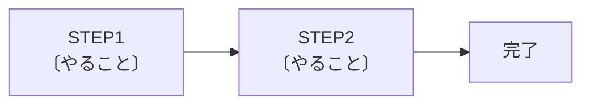

# 手順ページ

📍`🏠ホーム > ✏️wikiの編集方法 > テンプレート > 手順ページ`

---

**作業手順・セットアップ手順**を書くときのテンプレートです。

> 👉 書き方のルールは [ページの書き方](../ページの書き方.md)

<br>

## 📋 テンプレート

`````md
# 〔手順名〕

📍`🏠ホーム > 〔READMEの見出し1〕 > 〔READMEの見出し2〕 > 〔手順名〕`

---

〔この手順で何ができるようになるか、1〜2行で〕

> ⚠️ **事前に必要なもの**
> - 〔前提条件〕
> - 〔必要なツール〕

<br>

## 🔖 目次

| 項目 |
| --- |
| [STEP1 〔やること〕](#step1) |
| [STEP2 〔やること〕](#step2) |
| [❓ うまくいかないときは](#trouble) |

<br>

## 🗺️ 全体の流れ



<br>

---

## <a id="step1"></a>STEP1 〔やること〕

| # | 手順 |
| --- | --- |
| 1 | 〔操作〕 |
| 2 | 〔操作〕 |


> ⚠️ 〔ここで気をつけること〕

<br>

---

## <a id="step2"></a>STEP2 〔やること〕

| # | 手順 |
| --- | --- |
| 1 | 〔操作〕 |

```bash
〔実行するコマンド〕
```

<br>

---

## <a id="trouble"></a>❓ うまくいかないときは

| 症状 | 原因 | 対処 |
| --- | --- | --- |
| 〔症状〕 | 〔原因〕 | 〔対処〕 |

<br>

---

## 👀 関連ページ

- [〔関連ページ名〕](〔相対パス〕)
`````

<br>

---

## 💡 書くときのコツ

| # | コツ |
| --- | --- |
| 1 | **冒頭に「事前に必要なもの」**を書く。途中で足りないものに気づくのが一番つらい |
| 2 | 全体の流れを **mermaid の `flowchart LR`** で最初に見せる。何ステップあるか分かると心構えができる |
| 3 | 手順は **番号付きの表**にする。「1つの行＝1つの操作」 |
| 4 | **スクショは手順の直後**に置く。文章より先に画像を見る人が多い |
| 5 | 分岐は**表で条件と操作を対にする**（「使わない場合」「使う場合」） |
| 6 | **「うまくいかないときは」を必ず付ける**。同じ質問が減る |
| 7 | コマンドは ` ```bash ` で囲む。Giteaでコピーボタンが付く |

### 折りたたみで補足を隠す

通常は読まなくてよいもの（失敗時の対処など）は畳むと本筋が読みやすくなります。

```md
<details>
  <summary>⚠️ 失敗する場合の対処</summary>
  <div>

〔対処手順〕

  </div>
</details>
```

<br>

---

## 👀 関連ページ

- [ページの書き方](../ページの書き方.md)
- [汎用ページ](汎用ページ.md)
- [機能説明ページ](機能説明ページ.md)
- [コンポーネント説明ページ](コンポーネント説明ページ.md)
