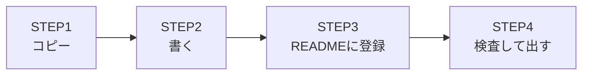

# ページを追加する

📍`🏠ホーム > 👷作業フロー > ページを追加する`

---

このwikiに新しいページを1枚足すまでの手順です。

> ⚠️ **事前に必要なもの**
> - このリポジトリのクローン
> - Python 3.9 以上（検査に使います）

<br>

## 🔖 目次

| 項目 |
| --- |
| [STEP1 テンプレートをコピーする](#step1) |
| [STEP2 中身を書く](#step2) |
| [STEP3 READMEに登録する](#step3) |
| [STEP4 検査して出す](#step4) |
| [❓ うまくいかないときは](#trouble) |

<br>

## 🗺️ 全体の流れ



<br>

---

## <a id="step1"></a>STEP1 テンプレートをコピーする

| # | 手順 |
| --- | --- |
| 1 | `wikiの編集方法/テンプレート/` から用途に合うものを選ぶ |
| 2 | 置きたいフォルダにコピーし、**ページ名に合わせて改名**する |

| 書きたいもの | 使うテンプレート |
| --- | --- |
| 迷ったら | `汎用ページ.md` |
| 手順・セットアップ | `手順ページ.md` |
| 「この定義を書いたらこう動く」 | `機能説明ページ.md` |
| 部品の仕様書 | `コンポーネント説明ページ.md` |

> ⚠️ ファイル名に `/ \ : * ? " < > |` は使えません。`・` に置き換えてください。

<br>

---

## <a id="step2"></a>STEP2 中身を書く

| # | 手順 |
| --- | --- |
| 1 | 1行目を `# ページ名` にする（**ファイル名と揃える**） |
| 2 | 2つ下の行に `📍` のパンくずを書く |
| 3 | テンプレートの `【】` を埋める |

パンくずの各名称は **README の表記に揃えます**（絵文字も含めて）。

```md
# ページを追加する

📍`🏠ホーム > 👷作業フロー > ページを追加する`
```

<br>

---

## <a id="step3"></a>STEP3 READMEに登録する

README の対応する見出しの下に、1行足します。

```md
- [ページを追加する](作業フロー/ページを追加する.md) … 新しいページを1枚足すまでの手順。
```

| 決まり | 理由 |
| --- | --- |
| **表示名はファイル名と同じにする** | 目次とファイルの食い違いを検査で見つけるため |
| 括弧や空白を含むパスは `<>` で囲む | 囲まないと Gitea でリンクが切れるため |
| 後ろに一言の説明を付ける | 開かずに中身が分かるため |

> 🚨 **README に登録していないページは検査で落ちます。**<br>
> 誰も辿り着けないページを増やさないための決まりです。

<br>

---

## <a id="step4"></a>STEP4 検査して出す

```bash
python3 scripts/wiki_lint.py
```

すべて `OK` になったらコミットします。NG が出たときは
[検査が落ちたときは](検査が落ちたときは.md) を見てください。

> ℹ️ Gitea に push すると同じ検査が自動でも走ります（`.gitea/workflows/wiki-lint.yml`）。

<br>

---

## <a id="trouble"></a>❓ うまくいかないときは

| 症状 | 原因 | 対処 |
| --- | --- | --- |
| `どのページも目次から辿れる` が NG | README に登録していない | STEP3 をやる |
| `目次の表記とファイル名がそろっている` が NG | 表示名とファイル名が違う | どちらかを揃える |
| `見出しとパンくずがある` が NG | `#` かパンくずが無い | STEP2 をやる |
| `python3` が無いと言われる | Python が入っていない | Python 3.9 以上を入れる |

<br>

---

## 👀 関連ページ

- [検査が落ちたときは](検査が落ちたときは.md)
- [ページの書き方](../wikiの編集方法/ページの書き方.md)
- [このwikiの読み方](../はじめに/このwikiの読み方.md)
