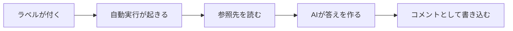

# GiteaのIssueにAIが返信する仕組み

📍`🏠ホーム > 📄製品・仕組み > GiteaのIssueにAIが返信する仕組み`

---

Gitea の Issue に**ラベルを付けるとAIが答えを書き込む**仕組みです。 
「これどうなってるんだっけ」を Issue に書けば、リポジトリを読んだうえで返答が付きます。

 

## 🔖 目次

| 項目 |
| --- |
| [1. 使い方](#usage) |
| [2. 動く流れ](#flow) |
| [3. ラベルで起動する理由](#label) |
| [4. 認証と課金](#auth) |
| [5. 安全のための制限](#safety) |
| [6. うまくいかないときは](#trouble) |

 

---

## 1. 使い方

| # | 手順 |
| --- | --- |
| 1 | Issue を立てる（用意したテンプレートを使うと書きやすい） |
| 2 | ラベルを付ける |
| 3 | しばらく待つと、AIの返答がコメントとして付く |

聞き方のコツは1つだけです。

> 💡 **どのリポジトリの話かを書く。** それだけで的中率が変わります。

 

---

## 2. 動く流れ

| 段階 | 何をしているか |
| --- | --- |
| 起動 | ラベルが付いた時だけ動く |
| 参照 | 設定に書いたリポジトリを読み取り用に取ってくる |
| 生成 | Issue の本文と参照先を渡して答えを作る |
| 返信 | Issue にコメントとして書き込む |

 

---

## 3. ラベルで起動する理由

> ⚠️ **「Issueが立った時」では二重に返信します。**

Gitea は Issue を立てたときとラベルを付けたときの**両方**で自動実行を起こせます。
両方を対象にすると、テンプレートでラベルが最初から付く運用では**同じ質問に2回**答えます。

| 起動条件 | 結果 |
| --- | --- |
| 立てた時＋ラベルが付いた時 | 二重に返信する |
| **ラベルが付いた時だけ** | 1回だけ返信する |

同じ Issue に対する実行が重ならないようにも制限しています。連続でラベルを付け外ししても、
返信が入り乱れません。

 

---

## 4. 認証と課金

| 認証のしかた | 課金 |
| --- | --- |
| APIキー | **使った分だけ請求される** |
| **サブスクリプション認証** | 契約プランの枠内。上限に達したら失敗するだけ |

> 🚨 **追加課金を出さない運用なら、サブスクリプション認証だけを設定してください。** 
> 両方を設定すると、どちらで動いたのか分からなくなります。
> そのため**両方あるときは動かさず、その場で止める**ようにしてあります。

上限に達したときは、エラーを投げっぱなしにせず
**「いつ再開するか」を日本時間で Issue に書きます**。待てばよいのか、対応が要るのかが分かるためです。

 

---

## 5. 安全のための制限

| 制限 | 理由 |
| --- | --- |
| 書き込みできる道具を渡さない | Issue の返信以外のことをさせない |
| 参照先は**設定に書いたものだけ** | 関係ないリポジトリを読ませない |
| 取得後に取得元の情報を消す | 認証情報が作業場所に残らないようにする |
| 参照先が取れなくても止めない | 1つ取れないだけで返信そのものが消えないようにする |
| 往復回数に上限を置く | 動き続けて枠を使い切らないようにする |

 

---

## 6. うまくいかないときは

| 症状 | 原因 | 対処 |
| --- | --- | --- |
| 返信が来ない | ラベルが付いていない | ラベルを付け直す |
| 同じ返信が2回来る | 起動条件が「立てた時」も含んでいる | ラベルだけにする |
| すぐ失敗する | 認証が2つとも設定されている | サブスクリプション認証だけにする |
| 「上限に達した」と返る | 契約プランの枠を使い切った | 返信に書かれた時刻まで待つ |
| 見当違いの答えが返る | どのリポジトリの話か書いていない | 対象を書いて聞き直す |

 

---

## 👀 関連ページ

- [用語集](../はじめに/用語集.md)
- [リポジトリの並べ方](../開発ルール/リポジトリの並べ方.md)
