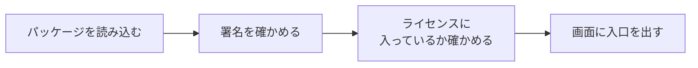

# TaskDeckの拡張パッケージ

📍`🏠ホーム > 📄製品・仕組み > TaskDeckの拡張パッケージ`

---

TaskDeck に**後から機能を足す仕組み**です。確定申告のデータ管理などを、本体を触らずに足せます。

 

## 🔖 できること早見

> このページの目次も兼ねています。

| やりたいこと | 見るところ |
| --- | --- |
| 何のための仕組みか知りたい | [1. 考え方](#idea) |
| 拡張がどう読み込まれるか知りたい | [2. 読み込みの流れ](#load) |
| 拡張を作りたい | [3. 拡張の中身](#inside) |
| 売り方を知りたい | [4. 売り方](#sell) |
| 今ある拡張を知りたい | [5. 今ある拡張](#list) |

 

---

## 1. 考え方

> 🚨 **基礎はタスク管理だけ。** 
> 拡張を1つも入れていない状態では、本体の見た目も動きも**一切変わりません**。

| 決め | 理由 |
| --- | --- |
| 本体に拡張の名前を書かない | 拡張が増えても本体を直さなくてよい |
| 拡張が無いとき、入口も出さない | 使わない人に**存在を意識させない** |
| 拡張はデータも自分の場所に持つ | 拡張を消しても本体のタスクは無傷 |

 

---

## 2. 読み込みの流れ

| 段階 | 何を見るか | 通らないとどうなるか |
| --- | --- | --- |
| 署名 | 売る側の鍵で署名されているか | 読み込まない |
| エンタイトルメント | ライセンスにその拡張名があるか | 体験版として動く |
| 体験版制限 | 拡張ごとに決めた上限 | 上限で止まる |

> ⚠️ **ライセンスを入れ替えたら、その場で入口が出る／消えるようにしてください。** 
> 再読み込みが必要な作りにすると「買ったのに使えない」と言われます。

 

---

## 3. 拡張の中身

拡張1つは、フォルダ1つです。

| ファイル | 役割 |
| --- | --- |
| `manifest.json` | 名前・版・体験版制限 |
| `main.js` | 中身。本体から渡された窓口だけを使う |
| `README.md` | その拡張の説明 |

本体は `api` という窓口だけを渡します。**本体の内部を直接触らせません**。

| 窓口 | できること |
| --- | --- |
| `api.storage` | その拡張専用の保存場所 |
| `api.tasks` | タスクの読み取り |
| `api.ui` | 画面に入口・画面を足す |

> ⚠️ **`main.js` は上から順に読まれます。** 
> 使う道具（関数・定数）は、使うより**前**に書いてください。
> 後ろに書くと、初回は動いて**再読み込みで落ちます**。実際にこれで1回落ちています。

 

---

## 4. 売り方

| 売り方 | 中身 |
| --- | --- |
| 本体のみ | タスク管理だけ |
| 本体＋拡張 | ライセンスに拡張名を入れて発行する |
| 拡張の追加購入 | ライセンスを再発行して渡す |

拡張を足しても**本体の配布物は同じ**です。渡すものはライセンスだけで済みます。

 

---

## 5. 今ある拡張

| 拡張 | 中身 |
| --- | --- |
| 確定申告（複式簿記） | 仕訳・総勘定元帳・試算表・損益計算書・貸借対照表。青色申告65万円控除向け |

> ℹ️ 税額の判定はしません。**帳簿を作るところまで**が担当です。
> 申告そのものは税務署・税理士の領分になります。

 

---

## 👀 関連ページ

- [TaskDeck](TaskDeck.md)
- [用語集](../はじめに/用語集.md)
